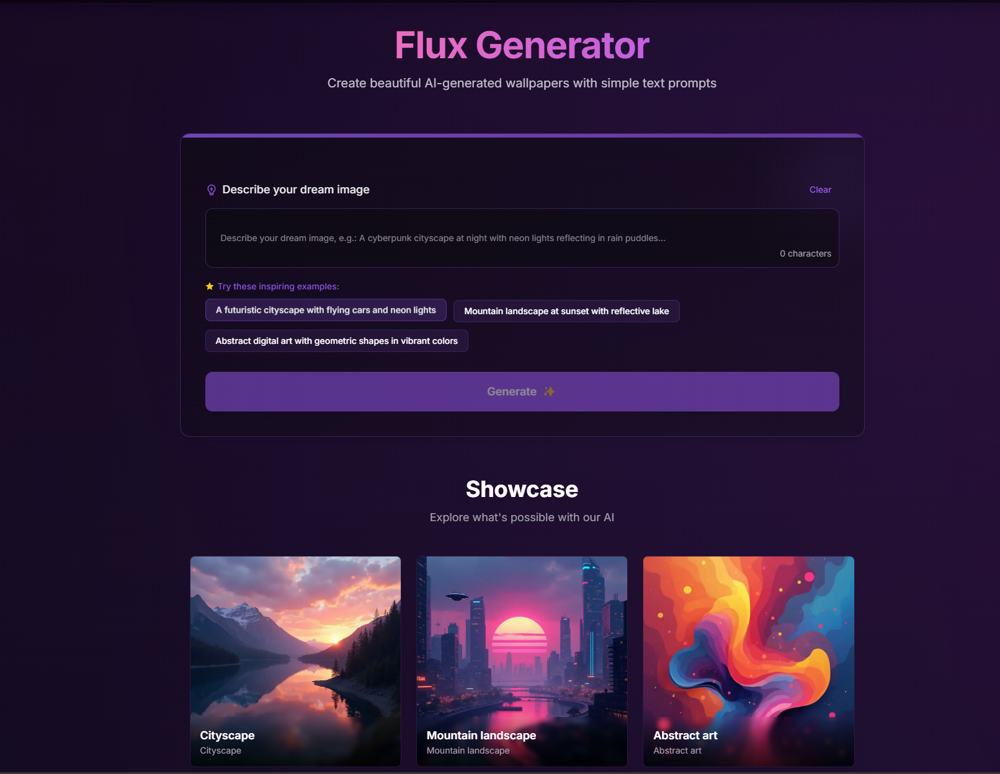

# 🚀 Katana-NextJS

<div align="center">

简体中文 | [English](./README.md)

</div>

✨ Nextjs Pages in a Swoosh! 一个现代化的 Next.js 框架，只需 5 分钟即可构建精美的单页应用。

## 🌟 框架预览

<div align="center">
  <div>
    
    <br />
    <em>🏠 主界面设计</em>
  </div>
  <br />
  <div>
    
    <br />
    <em>⚙️ 核心功能展示</em>
  </div>
</div>

## 🛠️ 环境要求

- Node.js 20.x 或更高版本
- Next.js 14.2.9
- pnpm (推荐) 或 npm

## 🚀 快速开始

1. 克隆仓库

```bash
git clone https://github.com/scottcwy/Katana-NextJS.git
```

2. 安装依赖

```bash
pnpm install
```

3. 运行开发服务器

```bash
pnpm dev
```

## ✨ 特性

- **📝 一行代码生成落地页**: 只需一个提示词，即可创建完整、专业的落地页
- **🔥 先进的 Next.js 框架**: 采用尖端技术构建，支持 Vercel 和 Cloudflare 部署
- **📚 全面的内容平台**: 集成管理仪表板、支持 Markdown 的博客系统和 SEO 工具
- **🔐 认证系统**: 随时可用的登录和用户管理功能
- **💳 支付集成**: 预配置的支付处理和安全结账流程
- **🌐 内置国际化**: 完全支持多语言，可无缝切换英文和中文
- **🎨 可定制主题**: 轻松修改配色方案和 UI 元素以匹配您的品牌
- **🖼️ 示例项目: Flux 生成器**: 包含 AI 壁纸生成器，展示框架功能

## 🧩 核心组件

### 1. 🎯 Hero 组件

Hero 组件用于创建引人注目的页面头部区域。

```tsx
// 使用示例
import Hero from "@/components/blocks/hero";

export default function Page() {
  return <Hero />;
}
```

### 2. 🎨 图像生成器组件

图像生成器组件提供 AI 驱动的图像生成界面。

```tsx
// 使用动态导入示例
import dynamic from 'next/dynamic';

const Generator = dynamic(() => 
  import('@/components/image/ImageGenerator').then(mod => mod.ImageGenerator), {
  ssr: false
});

export default function Page() {
  return <Generator />;
}
```

### 3. 💰 价格组件

价格组件用于展示定价计划和选项。

```tsx
// 使用示例
import Pricing from "@/components/blocks/pricing";

export default function Page() {
  return <Pricing />;
}
```

## 🔒 认证与支付

- 在 `.env` 中配置认证提供商

```bash
# 启用 GitHub 认证
NEXT_PUBLIC_AUTH_GITHUB_ENABLED="true"
```

- 设置支付集成

```bash
# 配置 Stripe 密钥
STRIPE_PUBLIC_KEY="your_stripe_public_key"
STRIPE_PRIVATE_KEY="your_stripe_private_key"
```

- 设置认证后即可访问管理后台 `/admin`

## ⚙️ 自定义配置

- 设置环境变量

```bash
cp .env.example .env.local
```
- 自定义主题
您可以使用 shadcn UI 的主题生成器轻松创建和应用自定义主题：

1. 访问 shadcn UI 主题生成器
2. 在主题生成器中调整颜色、圆角和字体等设置，直到满意为止
3. 点击右上角的"复制"按钮，复制生成的 CSS 代码
4. 将复制的代码粘贴到项目的 src/app/theme.css 文件中
5. 件后刷新应用，即可看到新主题效果

```css
@layer base {
  :root {
    /* 基础颜色 */
    --background: 0 0% 100%;
    --foreground: 222.2 84% 4.9%;
    
    /* 主要颜色 */
    --primary: 221.2 83.2% 53.3%;
    --primary-foreground: 210 40% 98%;
    
    /* 次要颜色 */
    --secondary: 210 40% 96.1%;
    --secondary-foreground: 222.2 47.4% 11.2%;
  }
}
/* README 修饰框样式 */
.readme-container {
  background: var(--card);
  border: 1px solid hsl(var(--card-border));
  border-radius: var(--radius);
  padding: 2rem;
  box-shadow: var(--card-shadow);
  margin: 1rem 0;
}
```

- 使用单个提示词生成新的落地页
- 在 AI 编辑器（如 Cursor 或 Windsurf）中，要求 AI 根据特定主题修改 i18n JSON 文件，实现一句话更改落地页的效果

## 🚀 部署

使用 Vercel 部署您自己的 Katana-NextJS 实例：

[](https://vercel.com/new/clone?repository-url=https%3A%2F%2Fgithub.com%2Fscottcwy%2FKatana-NextJS)

只需点击上方按钮即可部署，Vercel 将指导您完成设置过程。无需额外配置！

## ℹ️ 关于

- 版本: 0.2.1
- 作者: scottcwy
- 网站: [https://www.flux.xz.cn](https://www.flux.xz.cn)


